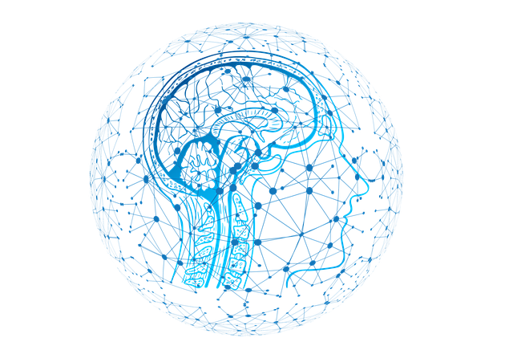

# rs-fMRI workflow from preprocessing to machine learning classification

# About me

[Catherine Landry (she/her)](https://github.com/catherinelandry)

Hello! I am currently doing my master's degree in psychology at the University of Montreal. My wide range of interests is reflected through my eclectic research background. I have worked with children at Sainte-Justine Hospital, trained spinal cord injured rats, and I am now doing research on individuals living with deafness. As of today, I'm particularly hyped about neuroimaging and coding, hence my learning journey with PSY6983. 

# Project Definition

## Background

Functional connectivity can be studied at different resolutions, scaling from locally functional areas to large and spatially distributed networks. At rest, brain regions with correlated temporal patterns with each other form resting state networks (RSN).  

Sensory deprivation leads to functional changes in the brain beyond the affected sensory modality. Various studies have found altered RSN in deaf individuals compared to controls (e.g., [Bonna et al., 2020](https://doi.org/10.1007/s11682-020-00346-y); [Ducas et al., 2021](https://doi.org/10.21203/rs.3.rs-246296/v1)). 

Supervised machine learning can yield characterization of rs-fMRI for individual-level predictions ([Khosla et al., 2019](https://doi.org/10.1016/j.mri.2019.05.031)).

### Main objectives:

* Learn reproductible neuroimaging workflow from preprocessing to data visualization to equip myself with open science tools for future neuroimaging projects.  

* Determine the most contributing features in machine learning prediction at single-participant level. The achieving goal would be to interpret the weight of the coefficients in accordance to the RSN.  

### Personal objectives set for the course:

* Familiarize myself with open science software and best practices 

* Learn how to code with python, specifically for neuroimaging purposes   

* Have a better understanding of machine learning and its application in neuroimaging 

## Tools

All the tools used for the project: 

* Bash Terminal 

* Visual Studio Code 

* Jupyter Notebook  
  
* Git and Github for version control

* BIDS for data management

* fMRIPrep for data preprocessing

* [`matplotlib`](https://matplotlib.org/), [`seaborn`](https://seaborn.pydata.org/), and [`plotly`](https://plotly.com/) for data visualization

* [`scikit-learn`](https://scikit-learn.org/stable/) and [`nilearn`](https://nilearn.github.io/) for machine learning 

## Data

The dataset comprises 5-minutes fMRI resting state images covering the whole brain of 34 adult participants, 16 of which have severe-to-profound prelingual deafness and 18 of which are hearing individuals that serve as controls. All participants were instructed to lie still and to avoid holding on to thoughts for the duration of the scanning. 

Here is a summary table of the sample:

|                 |Age (Mean±STD)|  Sex (F/M)   |Education (yrs)| Handedness |  
|-----------------|:------------:|:------------:|:-------------:|:----------:|  
|control (n=18)   |  29.89±5.27  |     13/5     |  16.9         | 15 right   |   
|deaf    (n=16)   |  30.00±4.33  |     12/4     |  15.9         | 12 right   |

**Age distribution across the participants** (Click **[here](https://catherinelandry.github.io/interactive_plot/age_description.html)** for an interactive plot!)

**Education distribution across the participants** (Click **[here](https://catherinelandry.github.io/interactive_plot/education_description.html)** for an interactive plot!)

For further questions on the dataset and the acquisition parameters, I encourage you to reach out to me at cath.landry2@gmail.com

## Deliverables

At the end of this project, I will have:

* Markdown file for the project repository 
* requirements.txt that lists all the packages used in the project
* Jupiter notebooks for the presentation slides and data visualization
* Python scripts for data prep and machine learning

# Results

## Progress overview

This project was initiated as part of the course PSY6983. The following sections detail the different steps taken to achieve the deliverables of the project.

 Source: Illustration created with Selman Design taken in Autodraw under the license CC BY 4.0 
 

### Data Management

Since my data was converted from dicom to Nifti prior to the beggining of the course, the first phase of the project was dedicated to organize my dataset into the BIDS format. This standardized neuroimaging structure enables the [FAIR guidelines](https://www.go-fair.org/fair-principles/) criteria of interoperability (I) and reusability (R), which corresponded with my objective to familiarize myself with the best practices in data management. Different tutorials and examples available in Github repos facilitated the BIDS conversion, such as: 

- [bids-starter-kit](https://github.com/bids-standard/bids-starter-kit)
- [bids-examples](https://github.com/bids-standard/bids-examples)

[BIDS Validator](https://bids-standard.github.io/bids-validator/) web browser based version was employed to confirm if the data configuration matched the BIDS standards. 

### Data Preprocessing

Step 1. The Open-access [fMRIPrep](https://fmriprep.org/en/stable/index.html) pipeline was used for minimal preprocessing. 

Step 2. [Load_confounds](https://github.com/catherinelandry/load_confounds) was installed and added to the data prep script as part of my denosing strategy. 

### Data Preparation

The Schaefer atlas (2018) was employed with node definition set at 100 ROI. Pairwise correlated time series were extracted to form a correlation matrix. 

*Note: the matrix contains redondant information, such as the pairs (i, j) and (j, i), which can bias the classification. Therefore, only the vectorized matrix of each participant was extracted and fed to the classifier.* 

### Machine Learning

## Tools learned during this project

- **Open science software:** 

- **Machine learning packages:** 

- **Data visualiaztion:** 

## Deliverables

By the end of the project, I was able to deliver:

- The [README.md](https://github.com/PSY6983-2021/clandry_project) file that details the present project
- The following python scripts:
	1. [Data Prep](https://github.com/PSY6983-2021/clandry_project/tree/main/codes)
	2. [Linear SVC](https://github.com/PSY6983-2021/clandry_project/tree/main/codes)
- The following Jupyter notebooks:
	1. [Presentation slides](https://github.com/PSY6983-2021/clandry_project/tree/main/notebooks) that can to be launch with the Rise extension
	2. [Data visualization](https://github.com/PSY6983-2021/clandry_project/tree/main/notebooks) containing the codes that plots the static and interactive figures in the repo. Note: this notebook was conceptualize to run specific code cells that calls the python scripts needed to retrieved the data
- The requirements.txt file with all the prerequisites packages used to run the codes      

# Conclusion

# Acknowledgement

A special thanks to Pierre Bellec for his advice and his insightful takes about the future of science practices. I would have been stuck longer on data preprocessing without Desiree's help and might have shed a tear without Andreanne and François coding skills. You have all facilitated my learning journey and provided me the necessary tools when I knocked by obstacles. A great thanks to Marie-Eve with whom I shared a couple coffees during our coding sessions. 

## References

Bonna, K., Finc, K., Zimmermann, M., Bola, L., Mostowski, P., Szul, M., Rutkowski, P., Duch, W., Marchewka, A., Jednorog, K., & Szwed, M. (2020). Early deafness leads to re-shaping of functional connectivity beyond the auditory cortex. Brain Imaging and Behavior, 1-14. https://doi.org/10.1007/s11682-020-00346-y 

Ducas, K. D., Senra Filho, A. C. D. S., Silva, P. H. R., Secchinato, K. F., Leoni, R. F., & Santos, A. C. (2021). Functional and structural brain connectivity in congenital deafness. Brain Structure and Function, 226(4), 1323-1333. https://doi.org/10.21203/rs.3.rs-246296/v1 

Khosla, M., Jamison, K., Ngo, G. H., Kuceyeski, A., & Sabuncu, M. R. (2019). Machine learning in resting-state fMRI analysis. Magnetic resonance imaging, 64, 101-121. https://doi.org/10.1016/j.mri.2019.05.031
